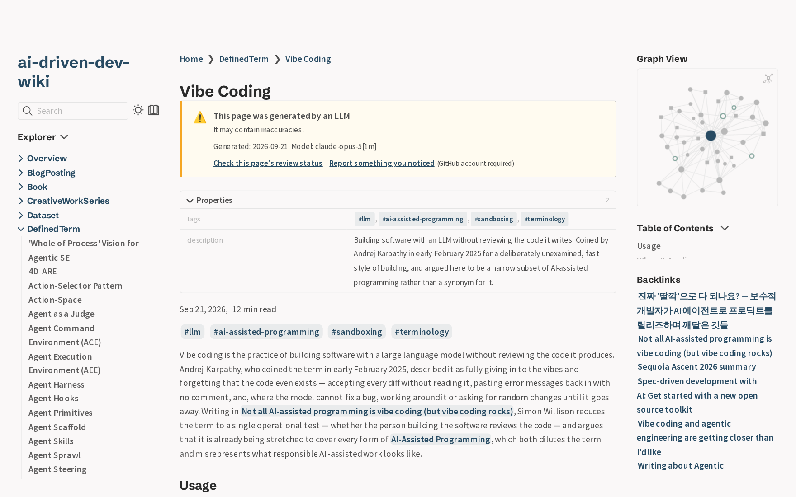
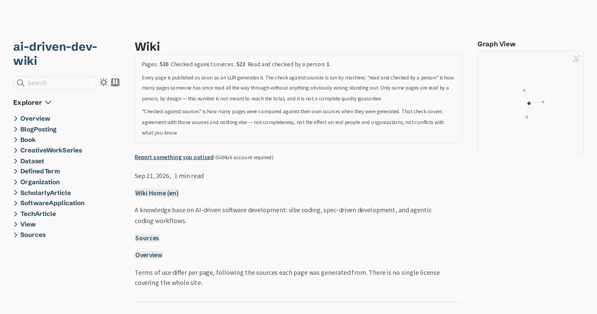
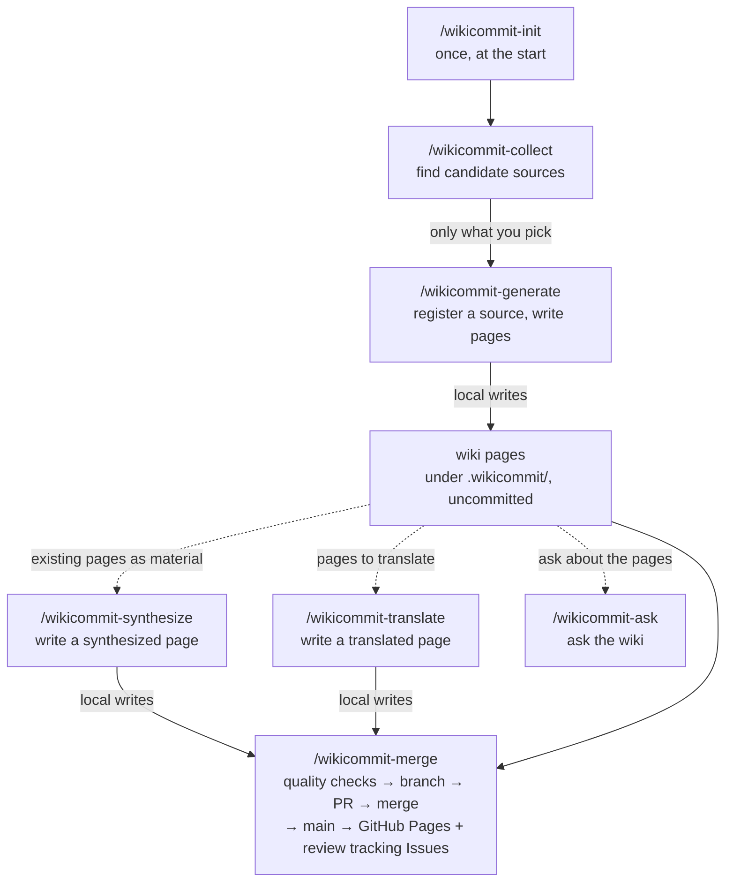

# WikiCommit

[](LICENSE)
[](https://github.com/wikicommit/wikicommit)

**English** | [日本語](README_ja.md)

A Git-based knowledge management platform. An LLM generates wiki pages from your source documents, and after automated and human review, they're published as a static wiki. It's implemented as a set of SKILL.md files and runs as-is on whatever LLM environment you already subscribe to, such as Claude Code.

**An LLM writes faster than one person can read, so review has to be splittable.** WikiCommit makes a single page the unit of review: one page is one tracking Issue, closed on its own. A reviewer reads that page and nothing else — not the rest of the knowledge base — and never has to wait on anyone else's review. That is what keeps a growing wiki from piling up behind one reader. Being splittable is also what makes it unnecessary to read them all: the machine checks every page against the documents it was written from, and a person reads a sample of those ([Step 3](#step-3-post-merge-review)).

> **Status**: Actively being validated through real-world use in pilot repositories; breaking changes may occur.

<picture>
  <source media="(prefers-color-scheme: dark)" srcset="assets/page-dark.png">
  
</picture>

*A page from [ai-driven-dev-wiki](https://wikicommit.github.io/ai-driven-dev-wiki/), one of the wikis listed below. That banner stays for good: being LLM-written does not stop being true once someone reads the page, so review adds a line saying a person has rather than taking the warning away.*

## What You Can Do

- **Multi-person, asynchronous review**: Pages are auto-merged and published once they pass the quality checks, so review never blocks publishing; each reviewer finishes by closing their page's Issue.
- **Automated from source discovery to page generation**: Automatically discovers un-ingested related sources from local folders and the web. Register a PDF, URL, or file in your repository, and it generates wiki pages.
- **GitOps**: Every change is recorded as a commit and PR. Auditing, rollback, and backup are all handled by `git log` alone.
- **Q&A over the wiki (RAG)**: Answers questions using wiki pages as the starting point, and can trace back to the primary sources to cite them when needed.
- **Multilingual support**: End-to-end support for translation generation, automatic detection of stale translations, and WikiLink language fallback.
- **Automatic publishing to GitHub Pages**: A merge to `main` triggers a build and deploy as a static site. Local preview before publishing is also available.
- **Health checks**: Detects orphan pages, expired pages, broken links, stale translations, and more.

**Use cases**: Well suited for internal technical documentation, product knowledge bases, research notes, community wikis, and other situations where you want to continuously generate and maintain a structured wiki from scattered sources (PDFs, URLs, files in an existing repository).

## Examples

Wikis that are actually running in production:

- **[ai-driven-dev-wiki](https://wikicommit.github.io/ai-driven-dev-wiki/)** — A wiki on AI-driven software development: vibe coding, spec-driven development, and agentic coding workflows. Written in English, with a Japanese translation under way.
- **[decameron-wiki](https://wikicommit.github.io/decameron-wiki/)** — A wiki about Giovanni Boccaccio's *The Decameron*, written in Italian, with **every page translated into English and Japanese**.

Each front page carries its own counts, recomputed on every build: how many pages there are, how many were checked against the sources they were written from, and how many a person has since read. That last number is a sample by design rather than a target — see [Step 3](#step-3-post-merge-review).

<picture>
  <source media="(prefers-color-scheme: dark)" srcset="assets/front-dark.png">
  
</picture>

## Basic Flow

### Step 1: Register a source + generate wiki pages

**(Optional) If you haven't decided which sources to ingest yet**: Running `/wikicommit-collect` discovers and lists candidate related sources — not yet ingested — from local folders and the web, based on the `theme` in `config.yml`. In light of copyright and license risks, only the candidates that a human reviews and selects are registered. Selected sources are then treated the same as `/wikicommit-generate`.

**Which sources to take in** is written in `.wikicommit/source-policy.md`, created by `/wikicommit-init`. It holds the rules in prose (`prefer primary sources`, `no promotional material`) plus a few lists: domains never to fetch, sources already turned down, and domains to read but never register.

**Whether a relevant subject may be written about at all** is a separate question, and lives in `.wikicommit/entity-policy.md` (also created by `/wikicommit-init`). `theme` decides relevance; this file decides permissibility — a living person at the centre of your subject scores highest on relevance and may still be someone you do not want a page about. It ships inert, with one switch (`exclude_living_persons`, off by default) and room for prose covering anything else you want kept out (private individuals, minors, matters under dispute, your own unreleased information). It applies when a page is generated and does not reach back; use `/wikicommit-remove` for a page that already exists.

That last one matters when an encyclopedia covers your subject. A page written from one encyclopedia article and nothing else tends to be a shorter version of that article, without its footnotes — and if the article is share-alike licensed, your page may inherit that obligation. Listing the domain under `index_only:`, or passing `--index <url>`, makes `/wikicommit-collect` read the article's **citations** and offer those primary sources instead; the article itself is never registered. The same works for a curated list — an awesome list, a "Further reading" page: list the page's URL (not its whole host) under `index_only:`, and `/wikicommit-collect` reads the sections that bear on each run's focus. Take the structural overview from a primary source, use the encyclopedia to find out what exists, and register an encyclopedia article outright only where no primary source does — which keeps the pages that may carry a share-alike obligation few and deliberate.

```
/wikicommit-collect --index https://en.wikipedia.org/wiki/<subject>
```

```
/wikicommit-generate <path|url>
```

- Generates a tracking file in `.wikicommit/source/` (`status: pending`)
- Automatically computes and records a hash
- Runs automatically in order: text extraction → content analysis → page generation → source-consistency review
- On completion → generated files are written to the working directory (no Git operations)

### Step 2: Quality checks, PR creation, merge

```
/wikicommit-merge
```

- Quality checks (frontmatter validation, WikiLink checks, raw HTML detection, external link validation, orphan page detection)
- Branch creation, PR creation, auto-merge (implemented without relying on GitHub's built-in auto-merge feature, so it works even on GitHub Free private repositories)
- Creates review-tracking Issues (`wikicommit-review` label) and generation-failure tracking Issues (`wikicommit-generation-failure` label)

**(Optional) To check how things look locally before or after merging**: `/wikicommit-serve [--build]` starts a local Quartz v5 build and preview server (no need to wait for the GitHub Pages deployment to complete).

### Step 3: Post-merge review

**The machine checks every page; a person reads some of them.** Each page is compared against the documents it was written from when it is generated, and the WikiLinks are validated before the merge — so the reading is not a re-run of either. What it adds is what no automated check reaches: whether a sentence is unfair to a real person or organization, whether the page conflicts with what you already know, and whether it contradicts another page written in a different batch. Reading every page is not the goal; `/wikicommit-status` lists the ones most worth a second look.

Check the review-tracking Issue (`wikicommit-review` label, automatically created for each page with `review_status: pending`). Closing it states two things: that this page's knowledge reached a person, and that nothing struck them as obviously wrong while reading. It is not a guarantee that the content is correct.

- **Nothing stood out** → Just close the Issue to finish. `review-issue-close-sync.yml` detects this, updates `review_status: reviewed`, and auto-merges.
- **Something stood out** → Leave it in a comment and keep the Issue open — the fix is not the reader's to make. `/wikicommit-fix <issue-url>` has the AI propose a fix based on the Issue body and comments; after human confirmation, `/wikicommit-merge` applies the fix, and then the Issue is closed.
- **Page created or edited directly by a human without going through an Issue** → `/wikicommit-review <page>` completes the frontmatter, runs a source-consistency check, and records review completion, then `/wikicommit-merge`.

Merging to `main` triggers a static wiki build via Quartz v5 and automatic deployment to GitHub Pages.

## Requirements

- [Claude Code](https://www.npmjs.com/package/@anthropic-ai/claude-code) (latest version recommended)
- Python 3.11+ (for the quality-check scripts)
- [`gh` CLI](https://cli.github.com/) (authenticated; used for PR creation and merging)
- Node.js 20+ (for `markdownlint-cli2`)
- [lychee](https://github.com/lycheeverse/lychee) (for external link validation; if not installed, `/wikicommit-init` makes a best-effort attempt to auto-install it)

> Because the Skills are a set of SKILL.md files compliant with the [agentskills.io](https://agentskills.io) standard, they should in principle work with other compatible coding agents such as Codex, but Claude Code is currently the only environment we've verified.
>
> **Under Codex, keeping a writing Skill from starting on its own rests on different mechanisms.** Nine Skills (`collect`, `fix`, `init`, `reconcile`, `remove`, `review`, `schema-propose`, `synthesize`, `update`) carry `disable-model-invocation: true`, a Claude Code setting that Codex ignores, and `.claude/settings.json`'s `skillOverrides` is likewise read only by Claude Code. For Codex each of those nine also ships `agents/openai.yaml` with `policy.allow_implicit_invocation: false`, and its description says to use it only when explicitly asked. Whether Codex actually honors that setting has not been verified on Codex itself yet; until it has, invoke those Skills by name (`$wikicommit-…`) and review what they leave before running `wikicommit-merge`.
>
> **WikiCommit needs network access and write access to `.git`.** The network is used to fetch URL sources (`/wikicommit-generate <url>`), by `gh` (the PR, the merge and the tracking Issues in `/wikicommit-merge`) and by lychee; `.git` is written by `/wikicommit-merge` (branch, commit) and by `/wikicommit-init` (its foundation commit). **Codex's default sandbox blocks both.** According to Codex's documentation ([Agent approvals & security](https://learn.chatgpt.com/docs/agent-approvals-security), checked 2026-09-24), an interactive session in a version-controlled folder defaults to `workspace-write`, where network access is off and `.git` (together with `.agents` and `.codex`) is kept read-only:
>
> - **Network** — enable it with `network_access = true` under `[sandbox_workspace_write]` in the Codex config. Without it, `/wikicommit-generate <url>` defers each source it cannot reach and stops after two in a row, and `/wikicommit-merge` fails at its first `gh` call.
> - **`.git`** — we have not found a setting in that documentation that makes `.git` alone writable while staying in `workspace-write`. What remains is to approve the git commands when Codex prompts for them, or to run in a mode that lifts the sandbox; the latter lowers the safety the sandbox provides, so it is listed here as a fact, not a recommendation.
> - **Non-interactive runs (`codex exec`)** — with `--ask-for-approval never`, a command that needs approval is not run and no prompt appears, so both of the above have to be opened in the configuration before the run.
>
> These settings are quoted from Codex's documentation; WikiCommit has not verified them on Codex itself yet, and this section will be updated once it has.

### Supported agents

| Agent | Status |
|---|---|
| Claude Code | **Verified** — the environment WikiCommit is developed and tested on. |
| Codex | **Expected to work, not yet verified on Codex itself** — the Skills follow the agentskills.io standard; see the notes above for the settings Codex needs. |
| GitHub Copilot — VS Code agent mode | **Targeted, hands-on verification pending.** According to its documentation it reads `.claude/skills/`, invokes Skills as `/wikicommit-…`, and honors `disable-model-invocation`, so none of the Codex caveats above should apply. |
| GitHub Copilot CLI | **Not verified.** It asks for approval before every shell command, and a Skill run makes dozens of script calls, so expect many prompts. The Skills deliberately do not declare `allowed-tools` to lift them (see below). |
| GitHub Copilot cloud agent | **Not supported.** It works inside a single PR it opens itself, so `/wikicommit-merge` would have to open and merge a second PR from inside that one; its default firewall blocks fetching URL sources; and a session is capped at 59 minutes. Supporting it needs a different merge step, not a setting. |

> **Fewer prompts in Copilot CLI is your call, not the Skills'.** Copilot CLI can pre-approve a command at launch with `copilot --allow-tool='shell(python)'`, which covers the WikiCommit scripts. It narrows only to the command name, so it also lets `python -c "…"` run unasked — in practice, permission to run arbitrary code while the session reads the text of external pages (`/wikicommit-generate <url>`, `/wikicommit-collect`). The Skills do not ship that permission for you. Adding `--deny-tool='shell(git push)'` stops pushes, but `/wikicommit-merge` pushes its PR branch with `git push`, so it stops merging as well.
>
> **Installing for Copilot alone?** Install for `--agent claude-code` only. Copilot reads both `.claude/skills/` and `.agents/skills/`, so an install that leaves Skills in both — a `--copy` install for Claude Code and Codex together, or any install to two or more agents without `--copy`, which puts the real files in `.agents/skills/` and symlinks them from `.claude/skills/` — may show each Skill twice; what Copilot does with two Skills of the same name is not documented and has not been checked yet.

### Context window

WikiCommit does not provide LLM inference — you bring your own Claude Code, GitHub Copilot or API contract, and that contract has a context requirement. `/wikicommit-generate` is the command that sets it: a fixed overhead of about 49K, plus a per-source cost for every source processed in the same run.

**That per-source cost varies a lot with the source** — a short blog post is far lighter, a PDF report far heavier. The two columns below are two measured points (about 15K from a single Japanese Wikipedia article, about 22K back-calculated from a mixed 30-source run), not a specification.

| Context window | at 15K/source | at 22K/source |
|---|---|---|
| 200K | about 10 | about 7 |
| 1M | about 63 | about 43 |

**Those are the points where a run stops fitting, not a setting you can raise.** Past them the session compacts mid-run, the Skill's own instructions are partly lost, and **the output still looks normal**. `/wikicommit-generate` asks before processing more than 5 sources in one run, but that is a prompt rather than a limit — answering "process all" is supported, and the table is what it costs. Splitting the work across separate runs is the reliable way past them: the sources you leave keep their state, and the next run picks them up.

In Claude Code, Opus 5 / 4.8 / 4.6 and Sonnet 4.6 default to a 200K window; Sonnet 5 and Fable 5 / 5.1 are natively 1M, and Opus reaches 1M with the `[1m]` suffix depending on your plan (figures as of 2026-09; see [Claude Code's model configuration docs](https://code.claude.com/docs/en/model-config) for the current ones).

You can measure your own sources after a single run: `grep extracted_tokens .wikicommit/source/**/*.md` — that field counts the extraction alone, so expect it to read lower than the per-source figures above. The breakdown of the fixed overhead, and exactly what a compaction drops, are in [docs/DesignDoc-skills.md](docs/DesignDoc-skills.md) §11.6.

## Installation

```bash
# Method 1: npx skills add (recommended; compliant with the agentskills.io standard; requires Node.js)
# Running it bare opens an interactive picker; it does not install everything silently.
# --copy is recommended -- see the note below.
npx skills add wikicommit/wikicommit --copy

# To install only a specific Skill
npx skills add wikicommit/wikicommit --skill wikicommit-generate --copy

# To install multiple specific Skills at once (repeat --skill)
npx skills add wikicommit/wikicommit --skill wikicommit-generate --skill wikicommit-merge --copy

# To install every Skill without prompts (when in doubt, this is a safe choice)
# Note: do not combine bare --all with --copy. --all is shorthand for
# --skill '*' --agent '*' -y, so with --copy it writes a full copy of every Skill
# into all ~50 supported agent directories; pin the agent instead.
npx skills add wikicommit/wikicommit --skill '*' --agent claude-code -y --copy

# Method 2: install.sh (simpler, no Node.js required; clone wikicommit anywhere,
# then run it from the root of your target wiki repository)
git clone --depth 1 https://github.com/wikicommit/wikicommit.git /tmp/wikicommit
cd /path/to/your-wiki-repo
bash /tmp/wikicommit/install.sh
# For Codex, add --agents to install into .agents/skills/ instead of .claude/skills/
```

> **Why `--copy`?** Whenever you install to two or more agents at once, `npx skills add` writes the real
> files to `.agents/skills/<name>/` and makes each agent's entry — including `.claude/skills/<name>` — a
> relative symlink pointing at them. That causes two problems for WikiCommit: (1) the symlinks do not
> survive being carried across a host → container filesystem boundary (observed with a devcontainer built
> after installing on the host — the Skills were simply not visible inside the container), and (2) a
> symlink committed to your wiki repository comes back as a plain text file in a clone made without
> symlink support — Windows' default `core.symlinks=false` — so the Skills are missing there. (Committing
> the symlinked layout otherwise works: `/wikicommit-init` and `/wikicommit-update` stage `.agents/` and
> `skills-lock.json` along with `.claude/`, so a clone does not end up with links pointing nowhere.)
> `--copy` gives you real files under
> `.claude/skills/`, matching what Method 2 does. (If you pick Claude Code alone in the picker the CLI
> already copies, so `--copy` simply makes that outcome explicit — keep it either way.)
>
> **Devcontainers and GitHub Codespaces**: install from *inside* the container, not on the host before
> building it. Doing so removes the boundary the symlinks cannot cross, and is worth doing even with
> `--copy` since the CLI's default placement may change.

After installation, run this in the repository where you want to initialize the wiki:

```
/wikicommit-init
```

> **Updating later**: the same commands install a newer WikiCommit, but they refresh only
> `.claude/skills/`. The scripts under `.wikicommit/scripts/` are the other half of the same
> release and update on a command of their own, so **run `/wikicommit-update` after every
> `npx skills add` or `install.sh`** (`/wikicommit-init --no-overwrite` refreshes them too). A
> repository carrying new Skills next to old scripts goes wrong in a way that is easy to
> misread: the Skills call a script in a way the older copy understands differently, so what
> you get is either a plain wrong answer or an error that points at the wrong thing. Either
> way the cause is the skew, and refreshing the scripts is the fix.

## Guides

Some setup is a procedure a person follows once, not something a Skill does. Those walkthroughs
are installed into your own repository at `.wikicommit/guides/` — one file per task, in English,
refreshed whenever you re-init or run `/wikicommit-update`. They are not in this repository's
`docs/`, because a change made there would never reach a wiki that is already installed.

Three so far:

- `applying-entity-policy-to-existing-pages.md` — what to do after changing
  `.wikicommit/entity-policy.md`. That policy is read only while a page is being generated, so a
  switch you flip afterwards reaches nothing you already have; one command puts the affected
  sources back in the queue, and the guide is mostly about what that command still leaves to you.
- `enabling-comments.md` — turning on the giscus comment box (off by default, and its
  prerequisites fail silently if you miss one), so this one only has something to say on a wiki
  initialized with `--quartz`.
- `updating-the-quartz-submodule.md` — moving the `quartz/` submodule to a newer Quartz. No Skill
  does this, the build leaves a change inside `quartz/` that makes a plain `git pull` there stop,
  and it is optional — the published site keeps the commit you recorded until you move it.

The directory is WikiCommit's rather than yours: a refresh overwrites what is there, and a file
of your own added alongside them is reported as an orphan by `/wikicommit-status` and offered
for deletion by `/wikicommit-update`. Keep your own notes somewhere else in the repository.

## Skills List

The main path — all 17 Skills are in the table below. **The write side stops at a local write; every Git operation happens in `/wikicommit-merge`.**



The inside of `/wikicommit-generate` — the four passes from text extraction through type selection, entity extraction, page generation and the check against the sources — is in [docs/DesignDoc-skills.md](docs/DesignDoc-skills.md) §11.6; a fuller version of the diagram above is in §11.2 of the same file.

| # | Category | Command | Description |
| --- | --- | --- | --- |
| 1 | Initialization | `/wikicommit-init` | Initialize a wiki in a repository |
| 2 | Generate/Register | `/wikicommit-generate <path\|url>` | Register a source + generate wiki pages |
| 3 | Generate/Register | `/wikicommit-collect` | Discover candidate related sources (requires human approval) |
| 4 | Generate/Register | `/wikicommit-synthesize <topic>` | Synthesize a new page from existing wiki pages (writes to `entity/`) |
| 5 | Generate/Register | `/wikicommit-translate <page> [--lang <target>]` \| `/wikicommit-translate` (batch) | Translate a page (local write-out only) |
| 6 | Review/Quality | `/wikicommit-merge` | Quality checks, PR creation, and merge |
| 7 | Review/Quality | `/wikicommit-review <page>` | Validate and review a page |
| 8 | Review/Quality | `/wikicommit-fix <issue-url>` \| `/wikicommit-fix <page-path\|published-url> "<instruction>"` | AI-assisted page fix (from an Issue / page path / published URL) |
| 9 | Review/Quality | `/wikicommit-remove <page>` | Remove a page (creates a PR) |
| 10 | Review/Quality | `/wikicommit-schema-propose` | Detect uncovered types and propose schema files (PR, not auto-merged) |
| 11 | Reference/Search | `/wikicommit-ask <question>` | Ask the wiki a RAG-style question |
| 12 | Reference/Search | `/wikicommit-search <query>` | Keyword search |
| 13 | Reference/Search | `/wikicommit-quiz [--difficulty=easy\|medium\|hard]` | Generate a quiz from wiki content |
| 14 | Operations/Preview | `/wikicommit-status` | Health check (orphans, unreviewed, expired) |
| 15 | Operations/Preview | `/wikicommit-serve [--build]` | Build and preview the wiki locally |
| 16 | Operations/Preview | `/wikicommit-update` | Bring the repository in step with the installed distribution (PR, not auto-merged) |
| 17 | Operations/Preview | `/wikicommit-reconcile <--source <path\|url>\|--type <Type>\|--all>` | Put sources back in the queue after a policy, type template or generation rule changed |

## Tech Stack

| Purpose | Technology |
| --- | --- |
| Static site generation | [Quartz v5](https://quartz.jzhao.xyz/) |
| Structured data | [Schema.org](https://schema.org/) |
| Knowledge representation spec | [OKF](https://github.com/GoogleCloudPlatform/knowledge-catalog/blob/main/okf/SPEC.md) (Open Knowledge Format) |
| Full-text search | SQLite FTS5 (trigram) |
| Link validation | [lychee](https://github.com/lycheeverse/lychee) |
| Markdown style | markdownlint-cli2 |

## Changelog

[CHANGELOG.md](CHANGELOG.md) records what changed in each version of WikiCommit itself — the Skills and the template tree they expand. The distribution repository carries no development history, so this file is the only way to learn what changed since the version you last installed, and it is what `/wikicommit-update` reads when it syncs a repository with a newer release.

## Design Docs

`docs/` holds the design record this project was built from. It is written in Japanese, and it is a record kept while building rather than a polished specification — its purpose is to preserve *why* something works the way it does, and what was considered and rejected. Start with [docs/DesignDoc-architecture.md](docs/DesignDoc-architecture.md) — the design principles, the overall architecture, and the major decisions. After that, read by the unit of a single decision — for example `docs/DesignDoc-data.md` §4.8 on how review records are stored — rather than front to back; the set is roughly 1 MB in total. [docs/README.md](docs/README.md) explains how to read it, including what the `Issue #NNN` references mean and which referenced paths are not part of this repository.

## Contributing

[docs/README.md](docs/README.md) explains how to read the design record — what is published here, what the `Issue #NNN` references mean, and which referenced paths are not part of this repository. [tests/README.md](tests/README.md) covers the test suite: how to run it, why much of it is written in Japanese, and which tests are skipped outside the development repository.

## License

[Apache License 2.0](LICENSE)
